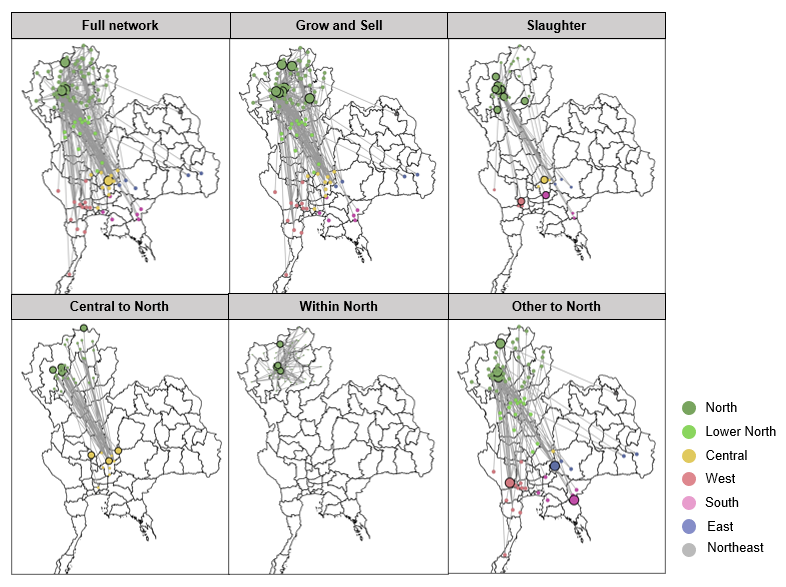

# Analysis notebook of the animal movement dataset

### Input files:
* a list of regions, provinces, and districts
* a dataset of movement (from, to, and attributes associated with nodes and edges)

### Results:
* Summarize the dataset with count tables
* Construct social networks to characterize pattern using network metrics
* Identify hotspot location with increased risk of transmission

