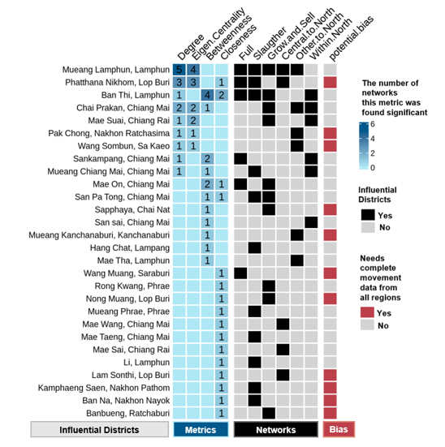

# Epidemiology analysis using Social Network Metrics 
### Animal movement patterns and the impact on transmission of zoonotic diseases 

### Input files:
* a list of regions, provinces, and districts
* a dataset of movement (from, to, and attributes associated with nodes and edges)

### Results:
* Summarize the dataset with count tables
* Construct social networks to characterize pattern using network metrics

* Identify hotspot locations with increased risk of transmission

### Publication:
https://doi.org/10.3389/fvets.2022.961696
